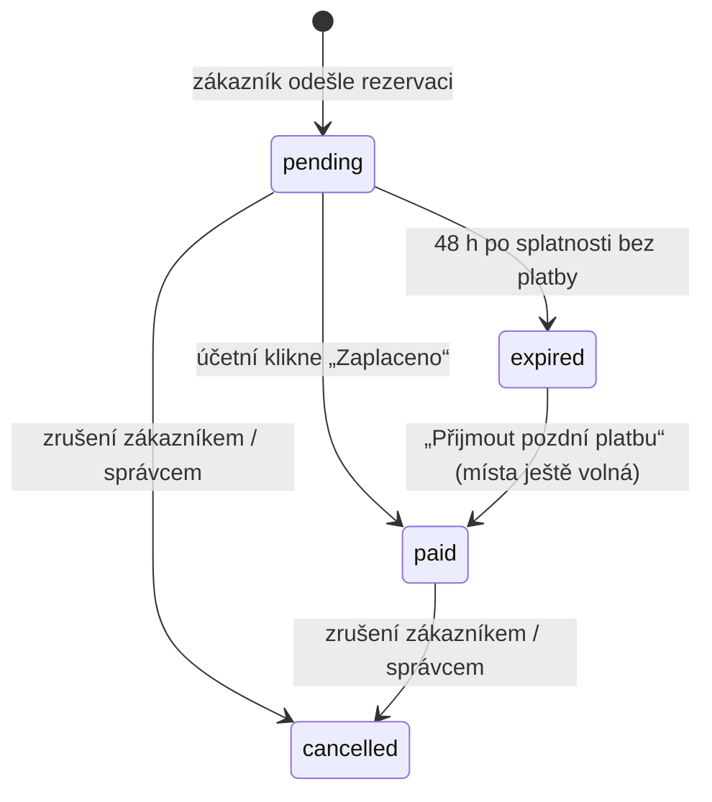

# Moje židle 2026 – dokumentace

Tato dokumentace popisuje všechny procesy aplikace tak, jak jsou
naprogramované. Hodnoty v textu (lhůty, limity, ceny) jsou výchozí
a lze je změnit v konfiguraci (kapitola [12](#12-konfigurace)) nebo
ve správě (kapitola [9.3](#93-záložka-nastavení)).

## Obsah

1. [Přehled aplikace](#1-přehled-aplikace)
2. [Uspořádání míst](#2-uspořádání-míst)
3. [Stavy rezervace](#3-stavy-rezervace)
4. [Výběr míst a odeslání rezervace](#4-výběr-míst-a-odeslání-rezervace)
5. [Platba](#5-platba)
6. [Zrušení rezervace a storno poplatky](#6-zrušení-rezervace-a-storno-poplatky)
7. [Vstupenka a odbavení u vchodu](#7-vstupenka-a-odbavení-u-vchodu)
8. [VIP hosté](#8-vip-hosté)
9. [Správa (admin.php)](#9-správa-adminphp)
10. [Přehled e-mailů](#10-přehled-e-mailů)
11. [Ochrana osobních údajů (GDPR)](#11-ochrana-osobních-údajů-gdpr)
12. [Konfigurace](#12-konfigurace)
13. [Ochrana proti spamu a robotům](#13-ochrana-proti-spamu-a-robotům)
14. [Instalace a provoz](#14-instalace-a-provoz)
15. [Technická reference](#15-technická-reference)

> **Pravidlo projektu:** každá změna kódu musí být ve stejném commitu
> promítnuta do této dokumentace (viz `CLAUDE.md`).

---

## 1. Přehled aplikace

Aplikace slouží k rezervaci míst na akci v kostele, k jejich zaplacení
bankovním převodem a k odbavení u vchodu.

| Část | Adresa | Kdo ji používá | K čemu |
| --- | --- | --- | --- |
| Rezervační stránka | `/` | veřejnost | výběr míst a rezervace |
| Stránka rezervace | `/?r=<kód>` | zákazník | platební údaje a QR platba, vstupenka, zrušení |
| Správa | `/api/admin.php` | účetní / správce (heslo `ADMIN_PASSWORD`) | potvrzení plateb, rušení, vracení peněz, VIP, nastavení |
| Odbavení | `/scanner.html` | pořadatelé u vchodu (heslo `ORGANIZER_PASSWORD`) | čtení vstupenek kamerou, VIP podle jména |
| Plánované úlohy | `api/cron.php` (každých 10 minut) | server | rušení nezaplacených rezervací, připomínky, mazání osobních údajů |

Všechny časy se zobrazují v pražském čase (Europe/Prague), v databázi jsou
uloženy v UTC.

---

## 2. Uspořádání míst

### 2.1 Sekce

| Kód | Sekce | Řady × míst v řadě | Kapacita |
| --- | --- | --- | --- |
| WL | Levé křídlo | 4 × 6 | 24 |
| ML | Levá hlavní | 10 × 8 | 80 |
| MR | Pravá hlavní | 10 × 8 | 80 |
| WR | Pravé křídlo | 6 × 6 | 36 |
| BL | Balkon vlevo | 4 × 12 | 48 |
| BC | Balkon střed | 4 × 12 | 48 |
| BR | Balkon vpravo | 2 × 10 | 20 |
| | **Celkem** | | **336** |

Každé místo má stálý identifikátor `SEKCE-ŘADA-MÍSTO`, např. `ML-1-1`,
`MR-10-8`, `BC-4-12`. Řada 1 je nejblíže pódiu (u balkonu nejblíže
zábradlí).

### 2.2 Plánek (přehled)

- Nahoře je **pódium**, pod ním vedle sebe Levé křídlo, Levá hlavní,
  Pravá hlavní a Pravé křídlo. Mezi hlavními sekcemi je volná ulička.
- Dole je **vchod**.
- **Balkon** je samostatný blok vzadu. Balkon vlevo a vpravo jsou otočené
  o 90° (tvar U), šipka ukazuje směr k pódiu.
- Velikost karet sekcí odpovídá skutečnému počtu řad a míst.
- Každá karta ukazuje jen název a obsazenost v procentech. Barva karty:
  - **zelená** – obsazeno méně než 50 %,
  - **oranžová** – 50 až 84 %,
  - **červená** – 85 % a více.
- Pokud má návštěvník v sekci vybraná místa, ukazuje karta červený
  odznak s jejich počtem.
- Nahoře je počet volných míst, součet ceny vybraných míst a tlačítko
  **Rezervovat**.

### 2.3 Detail sekce

Po kliknutí na sekci se zobrazí všechna místa s číslem řady a místa.
Nahoře je tlačítko *Zpět na mapu*, název sekce, počet volných míst
a obsazenost. U hlavní lodi je nahoře *Pódium* a dole *Vchod*, u balkonu
šipka *Směr k pódiu* a u bočních balkonů strana se zábradlím.

| Barva místa | Význam |
| --- | --- |
| světle zelená | volné |
| sytě červená | moje (vybrané v tomto prohlížeči) |
| světle červená | obsazené někým jiným (nelze kliknout) |

---

## 3. Stavy rezervace



| Stav | Česky | Místa drží? | Popis |
| --- | --- | --- | --- |
| `pending` | Čeká na platbu | ano | rezervace vytvořena, platba nepotvrzena |
| `paid` | Zaplaceno | ano | účetní potvrdila platbu, vstupenka odeslána |
| `expired` | Propadlo | ne | nezaplaceno do splatnosti + 48 h, místa uvolněna |
| `cancelled` | Zrušeno | ne | zrušil zákazník nebo správce |

Zrušení **jednotlivých míst** stav nemění – rezervace jen přijde o daná
místa (kapitola 6). Pokud se zruší všechna zbývající místa, rezervace
přejde do stavu *Zrušeno*.

Místo je obsazené právě tehdy, když patří rezervaci ve stavu *Čeká na
platbu* nebo *Zaplaceno*. Databáze nedovolí, aby jedno místo patřilo
dvěma rezervacím.

---

## 4. Výběr míst a odeslání rezervace

### 4.1 Výběr míst

1. Návštěvník kliká na volná místa v detailu sekce. Opětovným kliknutím
   výběr zruší.
2. Výběr je uložený jen v prohlížeči (po obnovení stránky zmizí)
   a nikomu jinému místa neblokuje, dokud není rezervace odeslána.
3. Najednou lze vybrat nejvýše **20 míst**. Při pokusu o další se ukáže
   hláška *„Najednou lze rezervovat nejvýše 20 míst.“*
4. Panel **Rezervace** ukazuje vybraná místa po sekcích, cenu
   (300 Kč za místo) a celkovou částku. Kliknutím na místo v panelu ho
   lze odebrat. Panel je vidět na přehledu a v detailu sekce, ve které je
   něco vybráno.
5. Obsazenost se každých 30 sekund (a při návratu do okna) načítá
   znovu. Pokud mezitím vybrané místo zarezervoval někdo jiný, vypadne
   z výběru a zobrazí se hláška *„Místa … mezitím rezervoval někdo jiný.“*
6. Po uzávěrce rezervací (`BOOKING_CLOSES_AT`) se místo tlačítka
   *Rezervovat* zobrazí *Rezervace uzavřeny* a místa nelze vybírat.

### 4.2 Formulář

Po kliknutí na **Rezervovat** se otevře formulář:

- **Jméno**, **Příjmení**, **E-mail** – povinné.
- Souhrn: počet míst × cena a celková částka.
- Informace: *„Splatnost 72 hodin, poté se místa uvolní.“*
- Storno podmínky, pokud jsou nastavené (např. *„Storno: zdarma do
  1. 12. 2026, od 1. 12. 2026 50 %, od 18. 12. 2026 100 % ceny.“*).
- Věta o ochraně údajů: *„Jméno a e-mail použijeme jen pro vyřízení této
  rezervace a do 30 dnů po skončení akce je smažeme.“*
- Tlačítko **Rezervovat a zaplatit**.

### 4.3 Co server zkontroluje (v tomto pořadí)

| Kontrola | Při nesplnění |
| --- | --- |
| Je nastaven bankovní účet | *„Platby nejsou nastaveny (BANK_IBAN).“* |
| Rezervace nejsou uzavřené | *„Rezervace jsou uzavřeny.“* |
| Ochrana proti robotům (kapitola 13) | *„Rezervaci se nepodařilo odeslat. Obnovte stránku a zkuste to znovu.“* |
| Jméno, příjmení, platný e-mail, 1–20 platných míst | chyba u příslušného pole |
| Nejvýše 5 rezervací za hodinu z jedné IP adresy | *„Příliš mnoho rezervací z tohoto zařízení…“* |
| Na e-mail nečekají už 2 nezaplacené rezervace | *„Na tento e-mail už čekají nezaplacené rezervace. Nejdříve je prosím uhraďte.“* |
| Žádné z míst mezitím nikdo nezarezervoval | *„Některá místa už mezitím někdo rezervoval.“* – formulář se zavře, obsazená místa vypadnou z výběru |

### 4.4 Vytvoření rezervace

Když vše projde, server v jedné transakci:

1. vytvoří rezervaci ve stavu **Čeká na platbu**,
2. přidělí jí **náhodný jedinečný 10místný variabilní symbol** (VS),
3. zablokuje místa,
4. nastaví **splatnost** = teď + 72 hodin,
5. pošle zákazníkovi **e-mail s platebními údaji** (pokud jsou e-maily
   zapnuté),
6. přesměruje zákazníka na **stránku rezervace** (`/?r=<kód>`).

Kód v odkazu je tajný a slouží jako přístup k rezervaci – kdo zná odkaz,
může rezervaci zobrazit i zrušit.

---

## 5. Platba

### 5.1 Stránka rezervace – čeká na platbu

Zobrazuje:

- **QR Platbu** (český standard SPD) s účtem, částkou, VS, specifickým
  symbolem, datem splatnosti a zprávou pro příjemce,
- číslo účtu, IBAN, variabilní symbol, specifický symbol (je-li
  nastaven) a částku – každý údaj s tlačítkem *Kopírovat*,
- datum splatnosti: *„Zaplaťte do … Jinak bude rezervace zrušena
  a místa uvolněna.“* Po splatnosti červeně: *„Splatnost … uplynula.
  Zaplaťte prosím co nejdříve, jinak bude rezervace brzy zrušena.“*,
- seznam míst, e-mail a možnost zrušení (kapitola 6).

**Specifický symbol** je pro všechny platby stejný (`PAYMENT_SPECIFIC_SYMBOL`).

### 5.2 Připomínka

24 hodin před splatností pošle plánovaná úloha e-mail **Připomínka
platby** s platebními údaji. Posílá se jen jednou a jen rezervacím,
které vznikly víc než 24 hodin před splatností.

### 5.3 Splatnost a propadnutí

- Zákazník vidí splatnost **72 hodin** od rezervace.
- Rezervace se ale zruší až **48 hodin po splatnosti** (rezerva na
  bankovní převod odeslaný poslední den).
- Pak přejde do stavu **Propadlo**, místa se uvolní a zákazník dostane
  e-mail **Rezervace zrušena** (*„platba … nedorazila včas…“*). E-mail
  se posílá jen jednou a jen u rezervací propadlých v posledních
  3 dnech.

### 5.4 Potvrzení platby (účetní)

1. Účetní najde platbu ve výpisu podle **variabilního symbolu**.
2. Ve správě vyhledá rezervaci (pole hledání přijímá VS, jméno, e-mail
   i místo) a klikne **Zaplaceno**.
3. Rezervace přejde do stavu **Zaplaceno**, uloží se přijatá částka.
4. Zákazníkovi odejde e-mail **Vstupenka** s QR kódem (kapitola 7).
5. Stránka rezervace od té chvíle místo platebního QR ukazuje vstupenku.

Úhradu kontroluje člověk – aplikace se k bance nepřipojuje. Nesprávnou
nebo částečnou platbu řeší účetní mimo aplikaci.

### 5.5 Pozdní platba

Pokud platba dorazí, až když je rezervace **Propadlo**, klikne účetní
**Přijmout pozdní platbu**:

- jsou-li všechna místa stále volná, rezervace se obnoví jako
  **Zaplaceno** a odejde vstupenka,
- je-li některé místo mezitím obsazené, rezervace se neobnoví a správa
  vypíše *„Místa … už mezitím obsadil někdo jiný. Platbu je nutné vrátit
  nebo domluvit jiná místa.“*

---

## 6. Zrušení rezervace a storno poplatky

### 6.1 Storno pravidla

Nastavují se ve správě (*Nastavení*): libovolný počet řádků **Od
(datum a čas) – Poplatek %**. Platí:

- před prvním datem je zrušení **zdarma**,
- od každého data platí uvedené procento (při překryvu nejvyšší),
- poplatek = cena rušených míst × procento, zaokrouhleno na celé koruny,
- poplatek se týká jen **zaplacených** míst – nezaplacené se ruší vždy
  zdarma.

Příklad: *od 1. 12. 50 %, od 18. 12. 100 %* → do 30. 11. zdarma,
1.–17. 12. polovina, od 18. 12. nic se nevrací.

### 6.2 Zrušení zákazníkem

Na stránce rezervace tlačítko **Zrušit rezervaci** (u více míst
**Zrušit rezervaci nebo jednotlivá místa**):

1. Zákazník zaškrtne místa, která chce zrušit (výchozí jsou všechna).
2. Stránka hned ukáže důsledek:
   - nezaplaceno, vše: *„Zrušíte celou rezervaci, místa se uvolní. Nic
     neplatíte.“*
   - nezaplaceno, část: *„Zrušíte 1 místo, zbytek rezervace zůstane.
     Nová částka k úhradě: …“*
   - zaplaceno: storno poplatek a *„… pošleme zpět na účet, ze kterého
     platba přišla.“*; při 100 % *„peníze se nevracejí“*; u části míst
     *„Na e-mail přijde nová vstupenka.“*
3. Po potvrzení server znovu spočítá poplatek podle **aktuálního** data
   a místa uvolní. Číslo účtu se nezadává – peníze se vždy vracejí na
   účet, ze kterého platba přišla.

Zrušit **nelze**: po začátku akce, po odbavení vstupenky u vchodu a u
rezervací *Propadlo* / *Zrušeno*.

### 6.3 Co se stane po zrušení

| Situace | Rezervace | Částka | E-mail zákazníkovi |
| --- | --- | --- | --- |
| nezaplaceno, všechna místa | Zrušeno | – | **Rezervace zrušena** |
| nezaplaceno, část míst | Čeká na platbu | sníží se, QR platba se změní | **Změna rezervace** s novými platebními údaji |
| zaplaceno, všechna místa | Zrušeno | poplatek + vrácení | **Rezervace zrušena** – poplatek, *„Částku … Vám do 14 dnů pošleme zpět na účet, ze kterého platba přišla.“* |
| zaplaceno, část míst | Zaplaceno | poplatek + vrácení za zrušená místa | **Nová vstupenka** – zrušená místa, poplatek, vrácení; *„Původní vstupenka už neplatí.“* |

Poplatky a vrácené částky se při opakovaném rušení sčítají. Zrušená místa
se ukládají do historie rezervace.

### 6.4 Zrušení správcem

Ve správě:

- **Zrušit** – celá rezervace,
- **zrušit jednotlivá místa** – zaškrtnutí míst a *Zrušit vybraná*
  (u rezervací s více místy).

Rozdíly proti zrušení zákazníkem:

- správce může rušit i po odbavení a po začátku akce,
- u zaplacených míst se **vrací celá cena** (bez storno poplatku),
- e-maily:
  - zaplaceno, celé: **Rezervace zrušena** – *„Částku … Vám do 14 dnů pošleme zpět na účet, ze kterého platba přišla.“*
  - zaplaceno, část: **Nová vstupenka** se stejnými údaji o vrácení,
  - nezaplaceno, část: **Změna rezervace** s novou částkou,
  - nezaplaceno, celé: e-mail se **neposílá**.

### 6.5 Vracení peněz

1. Ve správě karta **K vrácení** ukazuje celkovou dlužnou částku a počet
   rezervací; filtr *K vrácení peněz* je vypíše.
2. U rezervace je *„vrátit: 300 Kč na účet plátce“*.
3. Účetní pošle peníze zpět na účet, ze kterého platba přišla (najde ho
   ve výpisu podle VS), a klikne **Vráceno**.
4. Zaznamená se vrácená částka a datum. Pokud zákazník později zruší další
   místa, vznikne nový dluh jen ve výši nového vrácení.

---

## 7. Vstupenka a odbavení u vchodu

### 7.1 Vstupenka

- Posílá se e-mailem po potvrzení platby (a znovu po zrušení části míst).
  Obsahuje QR kód, jméno, počet míst, místa po sekcích a řadách a VS.
- Vstupenka je zároveň na stránce rezervace.
- Ve správě lze vstupenku poslat znovu (**Poslat znovu**).
- QR kód obsahuje text
  `Z26|ID rezervace|VS|počet míst|jméno|místa|podpis`.
  Podpis vytváří server tajným klíčem `TICKET_SECRET`; padělaný nebo
  upravený kód (včetně změněného ID) se pozná.
- Starší vstupenky bez ID rezervace (`Z26|VS|…`) scanner stále přijímá
  a hledá je podle VS.

### 7.2 Odbavení (scanner.html)

1. Pořadatel otevře na mobilu `scanner.html` a přihlásí se heslem
   pořadatele (přihlášení vydrží 24 hodin).
2. V režimu **Vstupenky** se spustí zadní kamera (je-li to možné, je
   k dispozici i svítilna).
3. Po načtení QR kódu telefon zavibruje a skenování se zastaví.
4. Scanner podle **ID rezervace** z QR kódu (a kontrolního VS) načte ze
   serveru **aktuální stav rezervace** – stav, jméno, platná místa, čas
   odbavení. Údaje vytištěné v QR kódu se použijí jen bez připojení.
5. Zobrazí se výsledek se jménem, počtem míst, místy po sekcích a řadách
   a řádkem *„Rezervace č. … · VS … · aktuální stav ze systému“*.
6. Tlačítkem **Skenovat další** se pokračuje.

| Výsledek | Barva | Kdy |
| --- | --- | --- |
| **Platná vstupenka** | zelená | zaplaceno, první načtení – zaznamená se příchod |
| **Už odbaveno** + čas prvního načtení | oranžová | vstupenka už byla načtena |
| **Nezaplaceno** | červená | rezervace čeká na platbu |
| **Rezervace zrušena** | červená | zrušeno nebo propadlo (i když se to stalo až po vydání vstupenky) |
| **Neplatný kód** | červená | cizí, padělaný nebo upravený kód, nebo rezervace s tímto ID a VS neexistuje |
| **To je platební QR kód** | červená | zákazník ukazuje QR platbu místo vstupenky |
| **Neověřeno – bez spojení** | oranžová | telefon je offline; údaje se jen přečtou z kódu (*„údaje z QR kódu, neověřeno“*) |

Pokud byla po vydání vstupenky zrušena část míst, ukáže se u výsledku
*„Část míst byla zrušena – platí jen uvedená místa.“* a zobrazí se
aktuální místa z databáze.

Odbavuje se celá rezervace najednou. Přijde-li část skupiny později,
uvidí pořadatel oranžové *Už odbaveno* s časem a rozhodne sám.

Kamera v prohlížeči funguje jen na webu s **HTTPS**.

---

## 8. VIP hosté

### 8.1 Správa VIP

Ve správě záložka **VIP**: formulář *Jméno, Sekce, Osob, Poznámka*
a tlačítko **Přidat VIP**. Seznam ukazuje sekci, počet osob, poznámku
a čas příchodu; u příchozích tlačítko **Zrušit příchod**, u všech
**Odstranit**. Nahoře je počet VIP hostů a *Přišlo X / Y osob*.

VIP hosté **neplatí**, **nedostávají vstupenku** a **neblokují konkrétní
místa** (nesnižují počet volných míst na webu).

### 8.2 Odbavení VIP

1. Ve scanneru přepínač **VIP** (kamera se vypne).
2. Host řekne jméno, pořadatel ho píše do pole *Hledat jméno*. Hledání
   nezáleží na diakritice ani pořadí slov („stastna anezka“ najde
   „Sestra Anežka Šťastná“) a hledá i v poznámce.
3. Lze filtrovat podle sekce.
4. U hosta je sekce, počet osob, poznámka a tlačítko **Vpustit**. Po
   kliknutí se zobrazí ✓ s časem a odkaz **Vrátit** (oprava omylu).
5. Kdo není na seznamu: červené *„Není na seznamu VIP“*.
6. Seznam se obnovuje každých 20 sekund, takže může odbavovat více
   pořadatelů najednou. Při současném kliknutí platí první čas příchodu.

---

## 9. Správa (admin.php)

Přihlášení heslem `ADMIN_PASSWORD`. Po 10 chybných pokusech z jedné
adresy se přihlášení na 15 minut zablokuje.

### 9.1 Záložka Rezervace

- Karty: **Čeká na platbu** a **Zaplaceno** (míst, Kč, počet rezervací),
  **K vrácení** (jen pokud něco dlužíme).
- Filtr podle stavu (včetně *K vrácení peněz*) a vyhledávání (VS, jméno,
  e-mail, místo).
- Tabulka: VS, jméno a e-mail, místa (a zrušená místa), částka (a přijatá
  částka, liší-li se), stav s historií (zaplaceno, vstupenka, odbaveno,
  kdo a kdy zrušil, storno, vráceno / vrátit), datum vytvoření,
  splatnost (po splatnosti červeně).

| Akce | U jakých rezervací | Co udělá |
| --- | --- | --- |
| **Zaplaceno** | Čeká na platbu | stav Zaplaceno, odešle vstupenku |
| **Přijmout pozdní platbu** | Propadlo | obnoví, jsou-li místa volná (5.5) |
| **Poslat vstupenku / Poslat znovu** | Zaplaceno | odešle vstupenku e-mailem |
| **Zrušit** | Čeká na platbu, Zaplaceno | zruší celou rezervaci (6.4) |
| **zrušit jednotlivá místa** | Čeká / Zaplaceno s více místy | zruší vybraná místa (6.4) |
| **Vráceno** | s dlužnou částkou | zaznamená vrácení peněz (6.5) |
| **změnit e-mail** | všechny | opraví e-mail zákazníka (pak lze poslat vstupenku znovu) |

Při načtení správy se nejdřív zpracují propadlé rezervace.

### 9.2 Záložka VIP

Viz kapitola 8.1.

### 9.3 Záložka Nastavení

- **Začátek akce** – od tohoto okamžiku nelze rezervace rušit; od něj se
  počítá smazání osobních údajů (zobrazí se datum smazání).
- **Storno poplatky** – řádky *Od – Poplatek %* (kapitola 6.1). Prázdné
  řádky se ignorují; po uložení přibude nový prázdný řádek. Neplatný
  řádek (chybí datum, procento mimo 0–100) se neuloží a zobrazí se chyba.

---

## 10. Přehled e-mailů

E-maily se posílají jen při `MAIL_ENABLED = true`, přes PHP `mail()`,
z adresy `MAIL_FROM`. Odkazy na stránku rezervace obsahují jen při
nastaveném `PUBLIC_URL`.

| Předmět | Kdy | Obsah |
| --- | --- | --- |
| Rezervace míst | po vytvoření rezervace | místa, platební údaje, splatnost, odkaz na QR platbu a zrušení |
| Připomínka platby | 24 h před splatností (cron) | platební údaje, splatnost |
| Rezervace zrušena | propadnutí (cron) | rezervace zrušena pro nezaplacení, odkaz na novou rezervaci |
| Vstupenka | Zaplaceno / Přijmout pozdní platbu / Poslat znovu | QR vstupenka, jméno, počet míst, místa, VS |
| Změna rezervace | zrušení části nezaplacené rezervace | zrušená a zbývající místa, nové platební údaje |
| Nová vstupenka | zrušení části zaplacené rezervace | zrušená místa, poplatek, vrácení do 14 dnů na účet, ze kterého platba přišla, nová QR vstupenka |
| Rezervace zrušena | zrušení celé rezervace zákazníkem, nebo zaplacené správcem | zrušená místa, poplatek, *„Částku … Vám do 14 dnů pošleme zpět na účet, ze kterého platba přišla.“* |

Všechny e-maily začínají oslovením jménem a končí podpisem *Moje židle
2026*.

---

## 11. Ochrana osobních údajů (GDPR)

- Ukládá se jen jméno, příjmení a e-mail. Číslo účtu se neukládá
  (peníze se vracejí na účet, ze kterého platba přišla). IP adresy se ukládají jen jako otisk (hash) pro limity
  a mažou se po 1 dni.
- Formulář informuje: *„Jméno a e-mail použijeme jen pro vyřízení této
  rezervace a do 30 dnů po skončení akce je smažeme.“*
- **30 dnů po začátku akce** (`DATA_RETENTION_DAYS`) plánovaná úloha:
  - smaže jména a e-maily u všech rezervací,
  - smaže celý seznam VIP hostů,
  - ponechá VS, částky, místa a stavy (účetní evidence).
- Mazání funguje jen při vyplněném **Začátku akce** v Nastavení.

---

## 12. Konfigurace

Soubor `api/config.local.php` (vzor `api/config.local.example.php`).
Hodnoty lze zadat i jako proměnné prostředí stejného jména. Výchozí
hodnoty jsou v `api/config.php`.

| Klíč | Výchozí | Význam |
| --- | --- | --- |
| `DB_HOST`, `DB_PORT`, `DB_NAME`, `DB_USER`, `DB_PASS` | 127.0.0.1, 3306, zidle, zidle, – | připojení k MariaDB |
| `SEAT_PRICE` | 300 | cena místa v Kč (u existujících rezervací se nemění) |
| `PAYMENT_DEADLINE_HOURS` | 72 | splatnost od vytvoření rezervace |
| `PAYMENT_GRACE_HOURS` | 48 | rezerva po splatnosti, než se rezervace zruší |
| `REFUND_DAYS` | 14 | lhůta vrácení peněz uváděná v e-mailech |
| `DATA_RETENTION_DAYS` | 30 | dní po akci, než se smažou osobní údaje |
| `BOOKING_CLOSES_AT` | – | uzávěrka nových rezervací, např. `2026-12-20 12:00` |
| `MAX_SEATS_PER_RESERVATION` | 20 | max. míst v jedné rezervaci |
| `RESERVATIONS_PER_IP_PER_HOUR` | 5 | limit rezervací z jedné IP za hodinu |
| `PENDING_RESERVATIONS_PER_EMAIL` | 2 | max. nezaplacených rezervací na jeden e-mail |
| `LOGIN_ATTEMPTS_PER_15_MIN` | 10 | pokusy o přihlášení (správa, scanner) z jedné IP |
| `FORM_MIN_SECONDS` | 3 | min. doba od načtení stránky do odeslání |
| `BANK_IBAN` | **povinné** | účet pro QR platbu |
| `BANK_BIC` | – | BIC (nepovinné) |
| `BANK_ACCOUNT_DISPLAY` | – | číslo účtu zobrazené zákazníkovi, např. `19-2000145399/0800` |
| `PAYMENT_RECIPIENT` | Farnost | jméno příjemce v QR platbě |
| `PAYMENT_MESSAGE` | Moje zidle 2026 | zpráva pro příjemce (doplní se příjmení) |
| `PAYMENT_SPECIFIC_SYMBOL` | – | specifický symbol pro všechny platby |
| `ADMIN_PASSWORD` | **povinné** | heslo do správy |
| `ORGANIZER_PASSWORD` | **povinné** | heslo do scanneru |
| `TICKET_SECRET` | **povinné** | tajný klíč pro podpis vstupenek (min. 16 znaků; po rozeslání vstupenek neměnit) |
| `MAIL_ENABLED` | false | zapnutí e-mailů |
| `MAIL_FROM` | rezervace@example.com | odesílatel e-mailů |
| `PUBLIC_URL` | – | adresa webu pro odkazy v e-mailech |
| `CORS_ORIGIN` | – | jen pokud běží web a API na různých doménách |

---

## 13. Ochrana proti spamu a robotům

| Ochrana | Jak funguje |
| --- | --- |
| Skryté pole | Formulář obsahuje neviditelné pole; vyplní ho jen robot → odmítnuto. |
| Podepsaný token | Stránka dostane od serveru token s časem a podpisem. Rezervace bez tokenu, s padělaným, starším než 12 h nebo odeslaná dřív než 3 s po načtení je odmítnuta. |
| Limit na IP | 5 rezervací za hodinu (počítají se jen formálně správné požadavky). |
| Limit na e-mail | Nejvýše 2 nezaplacené rezervace na jeden e-mail. |
| Limit přihlášení | 10 pokusů za 15 minut pro správu i scanner. |
| Limit rušení | 20 pokusů o zrušení za hodinu z jedné IP. |

Za proxy/CDN (např. Cloudflare) musí server znát skutečnou IP návštěvníka
(Apache `mod_remoteip`), jinak by všichni sdíleli jeden limit.

---

## 14. Instalace a provoz

### 14.1 Požadavky

PHP 8.1+ s rozšířeními PDO MySQL, GD, mbstring, intl; MariaDB 10.5+;
Composer; Node.js 20+ (jen pro sestavení webu); **HTTPS**.

### 14.2 Instalace

```bash
# databáze
mariadb -e "CREATE DATABASE zidle CHARACTER SET utf8mb4"
mariadb -e "CREATE USER 'zidle'@'localhost' IDENTIFIED BY '…'; GRANT ALL ON zidle.* TO 'zidle'@'localhost'"
mariadb zidle < db/schema.sql

# PHP knihovny (QR kódy v e-mailech)
(cd api && composer install --no-dev)

# konfigurace
cp api/config.local.example.php api/config.local.php   # a vyplnit

# sestavení webu
npm install && npm run build
```

Na hosting nahrajte obsah složky `dist/` a vedle něj složku `api/`
(včetně `api/vendor/`). Soubory `.htaccess` blokují přístup ke
konfiguraci a knihovnám.

### 14.3 Aktualizace existující instalace

Spusťte postupně skripty v `db/migrations/` (002 až 007), které ještě
nebyly použité. Všechny lze bezpečně spustit opakovaně.

### 14.4 Plánovaná úloha (cron)

```
*/10 * * * * php /cesta/k/api/cron.php
```

Každý běh: zruší rezervace po splatnosti + 48 h a uvolní místa, pošle
připomínky a oznámení o propadnutí, po akci smaže osobní údaje, promaže
staré záznamy limitů. Propadnutí se kontroluje i při každém načtení
webu, e-maily ale posílá jen cron.

### 14.5 Před spuštěním

1. Vyplnit `config.local.php` (účet, hesla, `TICKET_SECRET`, e-maily,
   `PUBLIC_URL`).
2. Ve správě → Nastavení zadat **začátek akce** a **storno poplatky**.
3. Zadat VIP hosty.
4. Vyzkoušet celý průběh: rezervace → e-mail → Zaplaceno → vstupenka →
   načtení ve scanneru.

### 14.6 Vývoj

```bash
php -S 127.0.0.1:8000 -t .   # API
npm run dev                  # web, /api se přesměruje na PHP
```

---

## 15. Technická reference

### 15.1 API

| Metoda | Adresa | Popis |
| --- | --- | --- |
| GET | `api/seats.php` | obsazená místa, cena, limity, storno pravidla, začátek akce, token formuláře |
| POST | `api/reservations.php` | vytvoření rezervace `{firstName, lastName, email, seats, formToken, hp}` |
| GET | `api/reservations.php?token=` | stav rezervace, platební údaje, vstupenka, podmínky zrušení |
| POST | `api/cancel.php` | zrušení zákazníkem `{token, seats?}` (bez `seats` = celá) |
| GET/POST | `api/organizer.php` | scanner: `login`, `logout`, `verify` (najde rezervaci podle ID z QR, vrátí aktuální stav a zaznamená odbavení), `vip-list`, `vip-checkin`, `vip-undo` |
| – | `api/admin.php` | správa (HTML stránka) |
| CLI | `api/cron.php` | plánované úlohy |

### 15.2 Databáze

| Tabulka | Obsah |
| --- | --- |
| `reservations` | rezervace: osobní údaje, místa, zrušená místa, částka, přijatá částka, VS, stav, splatnost, data plateb, vstupenky, připomínky, odbavení, storno poplatek, vrácení |
| `reservation_seats` | právě obsazená místa (primární klíč = místo → nelze rezervovat dvakrát) |
| `vip_guests` | VIP hosté |
| `settings` | začátek akce, storno pravidla |
| `rate_limits` | počítadla limitů (otisky IP) |

### 15.3 Formát QR kódů

- **QR Platba**: `SPD*1.0*ACC:<IBAN>*AM:<částka>*CC:CZK*X-VS:<VS>*DT:<splatnost>*MSG:<zpráva>*X-SS:<SS>*RN:<příjemce>`
- **Vstupenka**: `Z26|<ID rezervace>|<VS>|<počet míst>|<jméno>|<místa oddělená čárkou>|<podpis>`
  (starší vstupenky: bez ID rezervace)

### 15.4 Struktura kódu

| Cesta | Obsah |
| --- | --- |
| `src/` | webová aplikace (React) – plánek, detail sekce, formulář, stránka rezervace |
| `src/scanner/` | odbavovací aplikace (scanner.html) |
| `src/data/layout.js` + `api/lib/layout.php` | rozložení míst – **při změně upravit oba soubory** |
| `api/lib/` | logika serveru: rezervace, platby, vstupenky, rušení, e-maily, nastavení, ochrana proti spamu |
| `db/` | schéma databáze a migrace |
